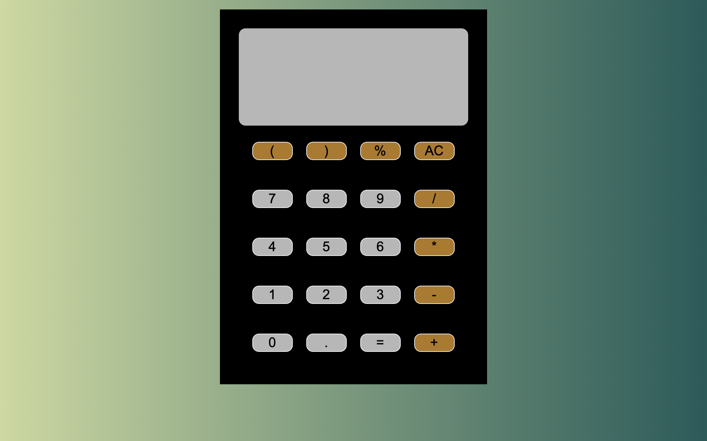

# Calculator 

- Project made by Axel Nalesso [Github](https://github.com/NalessoAxel)
- Date : *16/11/2020*

## What is it?

A basic calculator made with javaScript.

## What's the purpose of this?

Our goals for this exercie was to make a basic calculator using only Javascript.

## Language use 

- Html5
- CSS3
- JavaScript

## Problem

-  It's not possible to use 'Enter' from the keyboard to equal the operation. 
-  when you enter a number, the display change his height
- no bonus made 
## Responsive

No

## Preview

[Pages]()